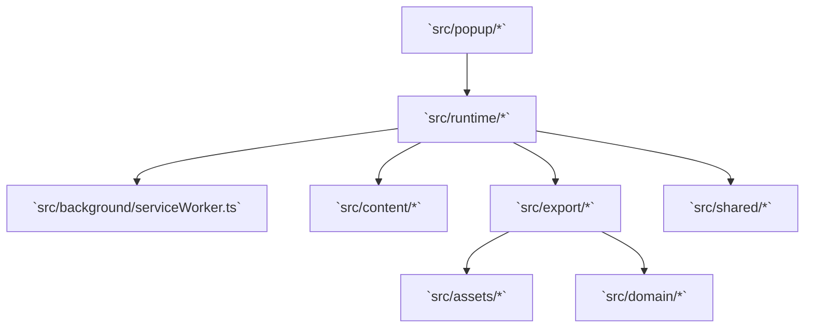
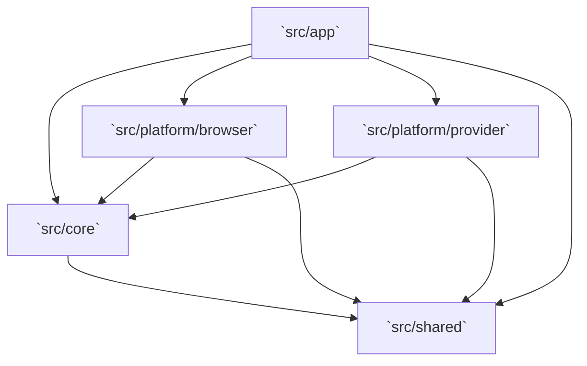
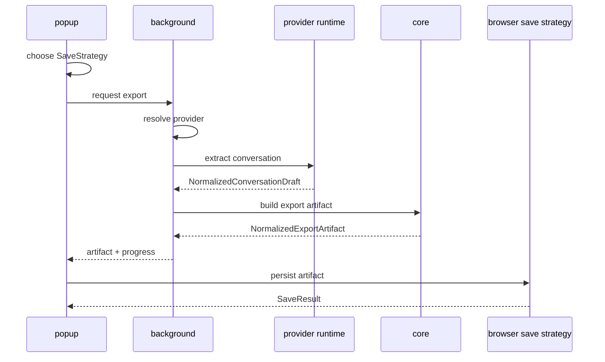

# Extension Platform Sourcecode Notes

Updated: 2026-05-15

## Observed Current Code

Current high-level source layout:

Observed characteristics:

- Current code already separates popup, content, background, export, and shared logic.
- Current separation is useful but not yet expressed as platform/browser vs platform/provider boundaries.
- Export persistence is still modeled around folder export in the current Chrome path.

## Desired / Planned Code

Target boundary model:

Forbidden dependencies:

- `platform/browser/*` -> `platform/provider/*`
- `platform/provider/*` -> `platform/browser/*`
- `core/*` -> browser/provider adapters

## Target Runtime Flow

## Key Contracts To Land In Code

- Browser: `BrowserApi`, `BrowserCapabilities`, `SaveStrategy`, `SaveContext`, `SaveResult`
- Provider: `ProviderId`, `ProviderDefinition`, `ProviderRegistry`, `ProviderExtractor`
- Normalized: `NormalizedPageSummary`, `NormalizedConversationDraft`, `NormalizedExportArtifact`, `ExportProgress`, `ProviderStatus`

## Current Key Files

- `src/platform/provider/providerRegistry.ts`: active multi-provider registry for `chatgpt` and `gemini`
- `src/runtime/exportCurrentChat.ts`: current runtime export entry used by app orchestration
- `src/app/exportCurrentChatApp.ts`: application orchestration wrapper used by background
- `src/core/buildExportArtifact.ts`: current core-owned normalized artifact builder
- `src/content/extractors/extractConversation.ts`: shared ChatGPT-oriented extractor baseline
- `src/content/extractors/extractGeminiConversation.ts`: Gemini-specific extractor under active hardening
- `src/content/extractors/providerExtractors.ts`: provider dispatch for content extraction
- `src/platform/browser/manifest.ts`: browser-specific manifest generation for `Chrome` and `Firefox`
